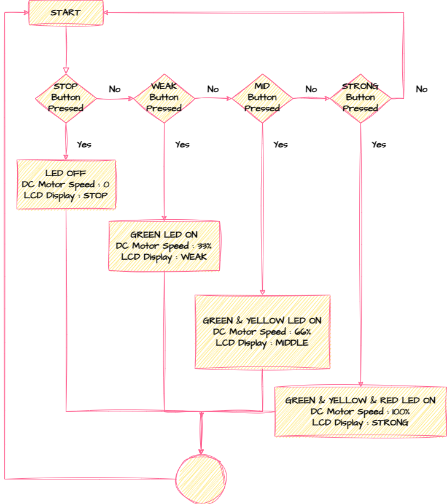
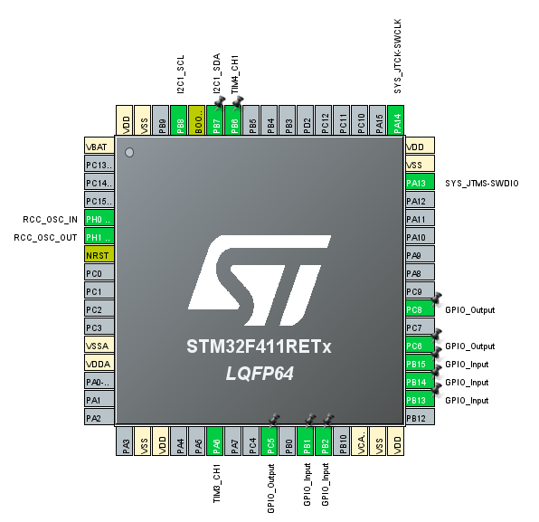

# Simple Fan

## 1. 프로젝트 개요

- 개발 기간: 2023.09.26. ~ 2023.09.27.
- 참여 인원: 1인
- 개발 언어: C
- 개발 환경: Window 11, STM32Cube IDE

## 2. 프로젝트 목표

ARM Cortex-M4 STM32F411RE Board를 사용해서 간단하게 동작하는 선풍기 설계 및 구현한다.

## 3. [프로젝트 내용](SIMPLEFAN.pdf)(SIMPLEFAN.pdf)

1. Flow Chart

2. Pin Layout

